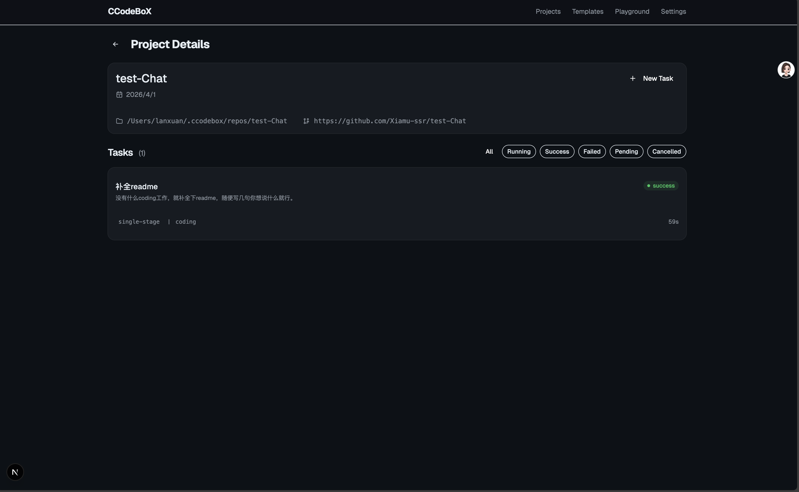
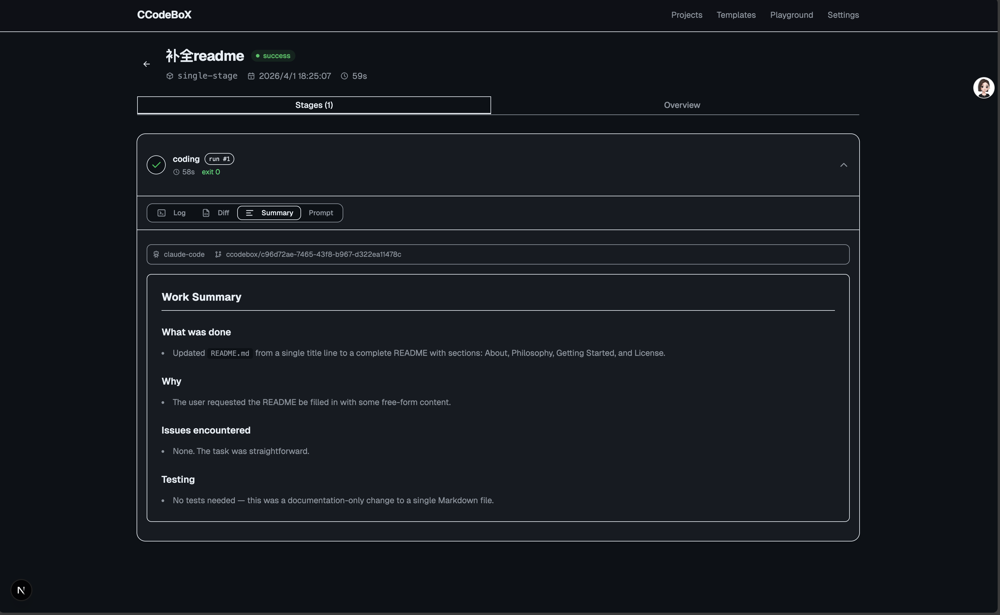

# CCodeBoX 📦

**Coding Agent 的执行环境层（Environment Layer）。**

不造 Agent，不做 Harness——只做一件事：让 Coding Agent（Claude Code、Codex）在隔离工作区里自动完成 **编码 → 测试 → 修复 → 交付** 的闭环。

> 你负责想法和架构决策，Agent 负责写代码，CCodeBoX 负责管理执行环境。




## 核心理念

- **去容器化**：直接调用用户电脑上已安装的 Agent CLI，零配置开箱即用
- **git worktree 隔离**：每个任务在独立 worktree 中执行，互不干扰，支持多任务并行
- **YAML 编排**：通过模板定义 stage 流转（coding → testing → retry），灵活可扩展
- **Environment Engineering**：不侵入 Agent 内部，只做感知→操作→验证→交付的环境层

## 快速开始

```bash
# 1. 确保已安装 Claude Code 或 Codex CLI
claude --version   # Claude Code
codex --version    # OpenAI Codex

# 2. 启动后端
cd backend
cargo run          # 默认 http://localhost:3456

# 3. 启动前端
cd frontend
npm install
npm run dev        # 默认 http://localhost:3001

# 4. 打开浏览器，创建项目 → 提交任务 → 看 Agent 干活
```

## 架构

```
┌──────────────┐     ┌───────────────┐     ┌─────────────────┐
│   Frontend   │────▶│   Backend     │────▶│  Agent CLI      │
│  Next.js 15  │◀────│  Rust / axum  │◀────│  CC / Codex     │
│  :3001       │     │  :3456        │     │  (本机直接调用)   │
└──────────────┘     └───────┬───────┘     └────────┬────────┘
                             │                      │
                       ┌─────┴─────┐    ┌───────────┴──────────┐
                       │  SQLite   │    │  git worktree 隔离    │
                       │  ~/.ccodebox/  │  ~/.ccodebox/workspaces/
                       └───────────┘    └──────────────────────┘
```

## 工作流程

1. **创建项目**：填项目名 + GitHub URL，后端自动 clone
2. **选择模板**：`single-stage`（单次执行）或 `feature-dev`（编码→测试→自动重试）
3. **提交任务**：写需求描述，选 Agent 和 Model（可选）
4. **自动执行**：
   - 创建 git worktree 隔离工作区
   - 组装三层 Prompt（平台规范 + 项目 AGENTS.md + 用户需求）
   - 调用 Agent CLI 执行任务
   - 收集产出（diff、log、summary）
   - 多 stage 模板自动流转，失败可重试
5. **查看结果**：Log、Diff（红绿高亮）、Summary、Prompt 一目了然

## 技术栈

| 层 | 技术 |
|---|---|
| 后端 | Rust + axum + SeaORM + SQLite |
| 前端 | Next.js 15 + React 19 + Tailwind CSS 4 + shadcn/ui |
| Agent | Claude Code CLI (`--print` 模式) / Codex CLI (`exec` 模式) |
| 隔离 | git worktree（每任务独立分支和工作目录） |
| 编排 | YAML 模板定义 stage 流转 |

## 项目结构

```
ccodebox/
├── backend/           # Rust 后端
│   ├── src/
│   │   ├── adapter/   # Agent 适配器（CC、Codex）
│   │   ├── api/       # REST API
│   │   ├── engine/    # 执行引擎（stage、task 编排）
│   │   ├── entity/    # 数据模型
│   │   └── workspace/ # git worktree 管理
│   └── task-types/    # 内置 YAML 模板
├── frontend/          # Next.js 前端
├── docs/              # 设计文档
├── scripts/           # 平台规范（system-rules.md）
└── assets/            # 截图
```

## License

MIT
